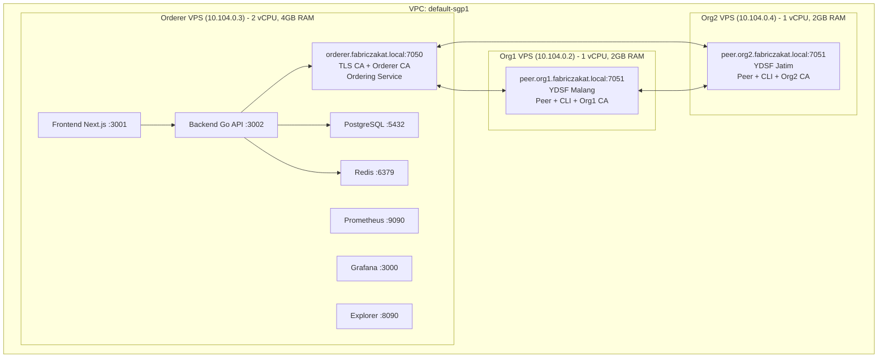
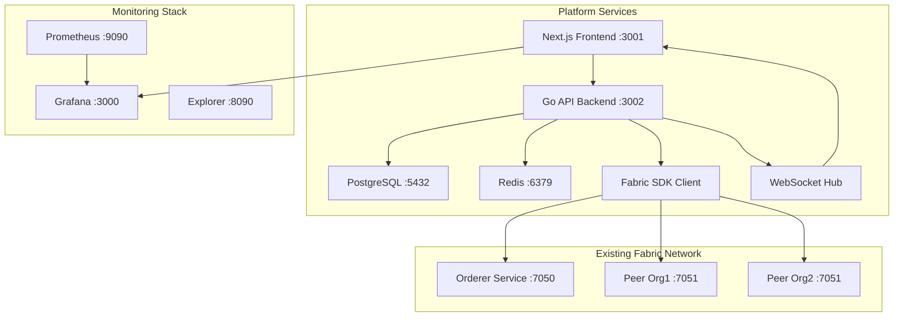

# Hyperledger Fabric Zakat Platform - Comprehensive Development Plan

## Table of Contents
1. [Project Overview](#project-overview)
2. [Architecture Decision](#architecture-decision)
3. [Technology Stack](#technology-stack)
4. [Network Infrastructure](#network-infrastructure)
5. [Development Approach](#development-approach)
6. [Implementation Tasks](#implementation-tasks)
7. [Database Design](#database-design)
8. [API Specifications](#api-specifications)
9. [Deployment Configurations](#deployment-configurations)
10. [Monitoring Integration](#monitoring-integration)
11. [Security Considerations](#security-considerations)
12. [Backup & Recovery](#backup--recovery)
13. [Performance Requirements](#performance-requirements)
14. [Future Enhancements](#future-enhancements)

---

## Project Overview

### Goal
Create a comprehensive blockchain-based zakat donation management platform with backend API and frontend interface, built on existing Hyperledger Fabric infrastructure.

### Target Users
- **Donatur (Donors)** - Can donate with/without registration
- **Petugas (Officers)** - Referral tracking and commission management  
- **Admins** - Super Admin (full access) and Org Admin (organization-specific)

### Key Features
- **Guest donation capability** - Reduces barriers to entry
- **Auto-validation system** - Streamlined payment processing
- **Real-time updates** - WebSocket-powered notifications
- **Unified dashboard** - Embedded Grafana charts + business interface
- **Transparency focus** - Blockchain audit trails for distribution tracking
- **Islamic design** - Green/gold theme appropriate for zakat platform

---

## Architecture Decision

### Selected: Hybrid Architecture (Option B)

**Rationale**: Optimal balance of performance, user experience, and resource efficiency for medium-scale deployment.

#### Benefits:
- ✅ Fast user response (PostgreSQL first)
- ✅ Blockchain as source of truth (eventual consistency)
- ✅ Built-in failure recovery
- ✅ Real-time query fallback system
- ✅ Supports expected 5-50 TPS transaction volume

#### Data Flow:
```
User Action → PostgreSQL (immediate) → Blockchain (async) → Event Listener → PostgreSQL Update
```

---

## Technology Stack

### Backend
- **Language**: Go (native Fabric SDK support)
- **Framework**: Gin/Fiber
- **Database**: PostgreSQL (primary) + Redis (cache/sessions)
- **Blockchain**: Hyperledger Fabric Go SDK
- **File Storage**: Local filesystem (Phase 1) → MinIO (Phase 2)

### Frontend
- **Framework**: Next.js (React with SSR/SSG)
- **Styling**: Tailwind CSS
- **UI Components**: Headless UI + custom components
- **Charts**: Recharts
- **Mobile**: Progressive Web App (PWA)
- **Theme**: Green (#10B981), Gold (#F59E0B), White

### Infrastructure
- **Deployment**: Docker Compose (MVP) → Kubernetes (Production)
- **Monitoring**: Existing Prometheus + Grafana stack
- **WebSocket**: Embedded in Go API for real-time updates
- **Authentication**: JWT + Redis sessions (30-day expiry)

---

## Network Infrastructure

### Current VPS Setup


### Service Architecture


---

## Development Approach

### 3-Phase Agile MVP

#### 🎯 MVP Phase 1 (2-3 weeks): Core Donation Flow
**Goal**: Basic donation submission and streamlined auto-validation

**Essential Features**:
1. Guest donation form (no registration required)
2. Admin login + validation dashboard
3. Auto-validation system (streamlined process)
4. Basic email notifications
5. Simple reporting
6. Docker Compose deployment

**Technical Implementation**:
- Chaincode modification: Add `AutoValidatePayment()` function
- Background job system for processing pending donations
- Email service with SMTP templates
- Basic PostgreSQL schema with sync status tracking

#### 📈 Phase 2 (2-3 weeks): User Management & Analytics
**Goal**: Complete user experience and monitoring

**Features**:
1. User registration/login system (phone/OTP preferred)
2. Officer referral tracking
3. Real-time WebSocket updates with room-based subscriptions
4. Unified dashboard with embedded Grafana charts
5. Distribution management interface

**Technical Implementation**:
- WebSocket hub with JWT authentication
- Room-based subscriptions (admin-room, public-room, user-specific)
- Unified admin dashboard with Grafana iframe integration
- Advanced database schema for users, roles, and audit trails

#### 🚀 Phase 3 (2-3 weeks): Advanced Features
**Goal**: Production-ready platform

**Features**:
1. Advanced reporting & exports (PDF/Excel)
2. WhatsApp/SMS integration
3. Payment gateway integration (replace mock)
4. Kubernetes deployment configuration
5. Performance optimization
6. Comprehensive backup strategy

---

## Implementation Tasks

### Task 1: MVP Phase 1 - Backend Infrastructure & Fabric Integration
**Complexity**: 8 | **Phase**: MVP
**Description**: Set up the core Go backend with Gin framework, PostgreSQL database, Redis cache, and Hyperledger Fabric SDK integration.

```go
// Project Structure:
// cmd/server/main.go - Application entry point
// internal/config/ - Configuration management
// internal/handlers/ - HTTP route handlers
// internal/services/ - Business logic
// internal/models/ - Data models
// pkg/fabric/ - Fabric SDK client
// pkg/database/ - Database connections
// migrations/ - Database schema migrations
// docker-compose.platform.yml - Development deployment

// cmd/server/main.go
package main

import (
	"log"
	"github.com/gin-gonic/gin"
	"github.com/zakat-platform/internal/config"
	"github.com/zakat-platform/internal/handlers"
	"github.com/zakat-platform/pkg/fabric"
	"github.com/zakat-platform/pkg/database"
)

func main() {
	cfg := config.Load()
	db := database.Connect(cfg.Database)
	fabricClient := fabric.NewClient(cfg.Fabric)
	
	r := gin.Default()
	handlers.SetupRoutes(r, db, fabricClient)
	log.Fatal(r.Run(":3002"))
}
```

### Task 2: MVP Phase 1 - Auto-Validation System & Chaincode Enhancement
**Complexity**: 7 | **Phase**: MVP
**Description**: Implement streamlined auto-validation system by adding AutoValidatePayment() function to chaincode.

```go
// Chaincode Enhancement - Add to zakat.go
func (s *SmartContract) AutoValidatePayment(ctx contractapi.TransactionContextInterface, zakatID string, paymentGatewayRef string) error {
	zakat, err := s.QueryZakat(ctx, zakatID)
	if err != nil {
		return fmt.Errorf("failed to query zakat %s: %w", zakatID, err)
	}

	if zakat.Status != "pending" {
		return fmt.Errorf("zakat %s is not in pending status", zakatID)
	}

	// Auto-validate with system-generated receipt
	receiptNumber := fmt.Sprintf("AUTO-%s-%d", time.Now().Format("20060102"), time.Now().Unix())
	return s.ValidatePayment(ctx, zakatID, receiptNumber, "system-auto")
}
```

### Task 3: MVP Phase 1 - Frontend Guest Donation Form
**Complexity**: 6 | **Phase**: MVP
**Description**: Create Next.js frontend with Tailwind CSS featuring Islamic green/gold theme.

```jsx
// components/DonationForm.tsx
const DonationForm = () => {
  const [formData, setFormData] = useState({
    name: '', phone: '', email: '', amount: '',
    type: 'maal', programId: '', referralCode: ''
  })

  return (
    <div className="min-h-screen bg-gradient-to-br from-green-50 to-yellow-50 py-12 px-4">
      <form className="bg-white p-8 rounded-xl shadow-lg border-2 border-green-100">
        <h2 className="text-3xl font-bold text-green-800 mb-6">Donate Zakat</h2>
        {/* Form implementation */}
      </form>
    </div>
  )
}
```

### Task 4: MVP Phase 1 - Admin Authentication & Basic Dashboard
**Complexity**: 7 | **Phase**: MVP
**Description**: Create admin login system with JWT authentication and role-based access control.

### Task 5: MVP Phase 1 - Email Notification System & Docker Deployment
**Complexity**: 5 | **Phase**: MVP
**Description**: Implement SMTP email notifications and Docker Compose configuration.

### Task 6: Phase 2 - Real-time WebSocket System & User Management
**Complexity**: 8 | **Phase**: 2
**Description**: Implement WebSocket server with room-based subscriptions and phone/OTP authentication.

### Task 7: Phase 2 - Unified Admin Dashboard with Grafana Integration
**Complexity**: 9 | **Phase**: 2
**Description**: Create comprehensive admin dashboard that embeds existing Grafana charts (Dashboard ID 10892).

### Task 8: Phase 3 - Production Deployment & Advanced Features
**Complexity**: 8 | **Phase**: 3
**Description**: Implement Kubernetes deployment, backup strategy, and advanced reporting features.

---

## Database Design

### PostgreSQL Schema

```sql
-- migrations/001_initial_schema.sql
CREATE TABLE users (
    id UUID PRIMARY KEY DEFAULT gen_random_uuid(),
    phone VARCHAR(20) UNIQUE NOT NULL,
    email VARCHAR(255),
    name VARCHAR(255) NOT NULL,
    role VARCHAR(20) CHECK (role IN ('donor', 'officer', 'org_admin', 'super_admin')),
    referral_code VARCHAR(20) UNIQUE,
    organization VARCHAR(50),
    created_at TIMESTAMP DEFAULT NOW(),
    updated_at TIMESTAMP DEFAULT NOW()
);

CREATE TABLE donations (
    id VARCHAR(50) PRIMARY KEY, -- ZKT-YDSF-MLG-202406-0001
    donor_id UUID REFERENCES users(id),
    donor_name VARCHAR(255) NOT NULL,
    donor_phone VARCHAR(20) NOT NULL,
    donor_email VARCHAR(255),
    amount DECIMAL(15,2) NOT NULL,
    type VARCHAR(20) CHECK (type IN ('fitrah', 'maal')),
    program_id VARCHAR(50),
    referral_code VARCHAR(20),
    blockchain_status VARCHAR(20) DEFAULT 'pending',
    sync_status VARCHAR(20) DEFAULT 'synced',
    payment_reference VARCHAR(100),
    validated_at TIMESTAMP,
    validated_by VARCHAR(100),
    created_at TIMESTAMP DEFAULT NOW(),
    updated_at TIMESTAMP DEFAULT NOW()
);

CREATE TABLE programs (
    id VARCHAR(50) PRIMARY KEY,
    name VARCHAR(255) NOT NULL,
    description TEXT,
    organization VARCHAR(50) NOT NULL,
    target_amount DECIMAL(15,2),
    collected_amount DECIMAL(15,2) DEFAULT 0,
    is_active BOOLEAN DEFAULT true,
    created_at TIMESTAMP DEFAULT NOW()
);

CREATE TABLE distributions (
    id VARCHAR(50) PRIMARY KEY,
    donation_id VARCHAR(50) REFERENCES donations(id),
    recipient_name VARCHAR(255) NOT NULL,
    recipient_details JSONB,
    amount DECIMAL(15,2) NOT NULL,
    distribution_date TIMESTAMP,
    distributed_by VARCHAR(100),
    blockchain_tx_id VARCHAR(100),
    created_at TIMESTAMP DEFAULT NOW()
);

CREATE TABLE audit_logs (
    id UUID PRIMARY KEY DEFAULT gen_random_uuid(),
    entity_type VARCHAR(50) NOT NULL,
    entity_id VARCHAR(50) NOT NULL,
    action VARCHAR(50) NOT NULL,
    performed_by VARCHAR(100),
    details JSONB,
    created_at TIMESTAMP DEFAULT NOW()
);

-- Indexes for performance
CREATE INDEX idx_donations_status ON donations(blockchain_status);
CREATE INDEX idx_donations_created_at ON donations(created_at);
CREATE INDEX idx_donations_donor_phone ON donations(donor_phone);
CREATE INDEX idx_users_phone ON users(phone);
CREATE INDEX idx_users_referral_code ON users(referral_code);
```

### Redis Schema

```
# Session Management
session:{jwt_token} -> user_id (30 days expiry)

# OTP Management  
otp:{phone_number} -> {6_digit_code} (5 minutes expiry)

# Caching
donation:{donation_id} -> JSON (1 hour expiry)
user:{user_id} -> JSON (30 minutes expiry)
dashboard:metrics -> JSON (5 minutes expiry)

# WebSocket Rooms
ws:room:admin-room -> {client_ids}
ws:room:public-room -> {client_ids}  
ws:room:user-{user_id} -> {client_ids}
```

---

## API Specifications

### Authentication Endpoints

```yaml
# POST /api/auth/admin/login
Request:
  phone: string (required)
  password: string (required)
Response:
  token: string
  user: { id, name, role, organization }

# POST /api/auth/otp/send  
Request:
  phone: string (required)
Response:
  message: "OTP sent successfully"

# POST /api/auth/otp/verify
Request:
  phone: string (required)
  otp: string (required)
Response:
  token: string
  user: { id, name, role }
```

### Donation Endpoints

```yaml
# POST /api/donations
Request:
  name: string (required)
  phone: string (required) 
  email: string (optional)
  amount: number (required, min: 1000)
  type: "fitrah" | "maal" (required)
  programId: string (optional)
  referralCode: string (optional)
Response:
  donationId: string
  status: "pending"
  message: "Donation submitted successfully"

# GET /api/donations/{id}
Response:
  id: string
  amount: number
  status: "pending" | "collected" | "distributed"
  donor: { name, phone }
  createdAt: timestamp
  validatedAt: timestamp (optional)
  distributedAt: timestamp (optional)

# GET /api/admin/donations
Query:
  status: string (optional)
  page: number (default: 1)
  limit: number (default: 20)
Response:
  donations: Array<Donation>
  totalCount: number
  currentPage: number
```

### Dashboard Endpoints

```yaml
# GET /api/admin/dashboard
Response:
  metrics:
    pendingDonations: number
    todaysCollection: number
    distributionsPending: number
    networkHealth: "healthy" | "warning" | "error"
  recentActivity: Array<{
    type: string
    message: string  
    timestamp: string
  }>
```

---

## Deployment Configurations

### Docker Compose (MVP Phase 1)

```yaml
# docker-compose.platform.yml
version: '3.8'

services:
  zakat-backend:
    build: 
      context: ./backend
      dockerfile: Dockerfile
    ports:
      - "3002:3002"
    environment:
      - DB_HOST=postgres
      - REDIS_HOST=redis
      - FABRIC_CONFIG_PATH=/fabric/config
    volumes:
      - ./organizations:/fabric/organizations:ro
      - ./channel-artifacts:/fabric/channel-artifacts:ro
    depends_on:
      - postgres
      - redis
    networks:
      - fabric_network
      - platform_network
    restart: unless-stopped

  zakat-frontend:
    build:
      context: ./frontend
      dockerfile: Dockerfile
    ports:
      - "3001:3000"
    environment:
      - NEXT_PUBLIC_API_URL=http://localhost:3002
      - NEXT_PUBLIC_WS_URL=ws://localhost:3002
    depends_on:
      - zakat-backend
    networks:
      - platform_network
    restart: unless-stopped

  postgres:
    image: postgres:15-alpine
    environment:
      - POSTGRES_DB=zakatplatform
      - POSTGRES_USER=zakat
      - POSTGRES_PASSWORD=secure_password
    ports:
      - "5432:5432"
    volumes:
      - postgres_data:/var/lib/postgresql/data
      - ./migrations:/docker-entrypoint-initdb.d
    networks:
      - platform_network
    restart: unless-stopped

  redis:
    image: redis:7-alpine
    command: redis-server --appendonly yes
    ports:
      - "6379:6379"
    volumes:
      - redis_data:/data
    networks:
      - platform_network
    restart: unless-stopped

volumes:
  postgres_data:
  redis_data:

networks:
  fabric_network:
    external: true
  platform_network:
    driver: bridge
```

### Kubernetes (Phase 3)

```yaml
# k8s/zakat-platform-deployment.yaml
apiVersion: apps/v1
kind: Deployment
metadata:
  name: zakat-backend
  namespace: zakat-platform
spec:
  replicas: 2
  selector:
    matchLabels:
      app: zakat-backend
  template:
    metadata:
      labels:
        app: zakat-backend
    spec:
      containers:
      - name: zakat-backend
        image: zakat-platform/backend:latest
        ports:
        - containerPort: 3002
        env:
        - name: DB_HOST
          value: postgres-service
        - name: REDIS_HOST  
          value: redis-service
        resources:
          requests:
            memory: "256Mi"
            cpu: "250m"
          limits:
            memory: "512Mi"
            cpu: "500m"
        livenessProbe:
          httpGet:
            path: /health
            port: 3002
          initialDelaySeconds: 30
          periodSeconds: 10
```

---

## Monitoring Integration

### Unified Dashboard Approach

#### Embedded Grafana Charts
- **Dashboard ID 10892**: Hyperledger Fabric overview
- **Network Performance**: Live blockchain metrics
- **Transaction Throughput**: Zakat transactions per second
- **Business Metrics**: Donation rates, validation efficiency

#### WebSocket Integration
```javascript
// Real-time updates from blockchain events
const wsUrl = `${process.env.NEXT_PUBLIC_WS_URL}/ws?token=${token}`
const ws = new WebSocket(wsUrl)

ws.onmessage = (event) => {
  const data = JSON.parse(event.data)
  if (data.type === 'donation_validated') {
    updateDashboardMetrics(data.payload)
  }
}
```

#### Room-based Subscriptions
- **admin-room**: New donations, system alerts, validation queue updates
- **public-room**: Live donation counters, achievement milestones
- **user-{userID}**: Personal donation status updates

---

## Security Considerations

### Authentication & Authorization
- **JWT tokens** with Redis session management
- **Role-based access control** (donor, officer, org_admin, super_admin)
- **Phone/OTP primary**, email/password fallback
- **30-day session expiry** with "Remember Me" option

### Data Protection
- **Audit trails** in both PostgreSQL and blockchain
- **Input validation** and sanitization
- **HTTPS/TLS** for all communications
- **Fabric client identity** for blockchain operations

### API Security
```go
// Middleware for JWT validation
func AuthMiddleware() gin.HandlerFunc {
    return func(c *gin.Context) {
        token := c.GetHeader("Authorization")
        if token == "" {
            c.JSON(401, gin.H{"error": "Authorization required"})
            c.Abort()
            return
        }
        
        claims, err := jwt.ValidateToken(token)
        if err != nil {
            c.JSON(401, gin.H{"error": "Invalid token"})
            c.Abort()
            return
        }
        
        c.Set("user", claims)
        c.Next()
    }
}
```

---

## Backup & Recovery

### Daily Automated Backups

```bash
#!/bin/bash
# scripts/backup.sh - Automated backup script

BACKUP_DIR="/opt/zakat-platform/backups"
DATE=$(date +%Y%m%d_%H%M%S)
RETENTION_DAYS=30

# PostgreSQL backup
echo "Starting PostgreSQL backup..."
pg_dump -h localhost -U zakat -d zakatplatform > "$BACKUP_DIR/postgres_$DATE.sql"
gzip "$BACKUP_DIR/postgres_$DATE.sql"

# Redis backup
echo "Starting Redis backup..."
redis-cli --rdb "$BACKUP_DIR/redis_$DATE.rdb"
gzip "$BACKUP_DIR/redis_$DATE.rdb"

# Files backup (uploads, configs)
echo "Starting files backup..."
tar -czf "$BACKUP_DIR/files_$DATE.tar.gz" \
  /opt/zakat-platform/uploads \
  /opt/zakat-platform/config \
  /opt/zakat-platform/docker-compose.yml

# Sync to backup VPS
echo "Syncing to backup server..."
rsync -av "$BACKUP_DIR/" backup-server:/backups/zakat-platform/

# Cleanup old backups
find "$BACKUP_DIR" -name "*.gz" -mtime +$RETENTION_DAYS -delete

echo "Backup completed: $DATE"
```

### Recovery Procedures
- **PostgreSQL**: Restore from compressed SQL dumps
- **Redis**: RDB file restoration with data consistency checks
- **Files**: Rsync from backup server
- **Blockchain**: Distributed ledger provides inherent backup

---

## Performance Requirements

### Expected Metrics
- **Target TPS**: 10-50 transactions per second
- **Latency**: < 2-5 seconds for transaction completion
- **Availability**: 99.5% uptime
- **Response Time**: < 500ms for API calls
- **WebSocket**: < 100ms message delivery

### Optimization Strategies
- **Database indexing** for frequent queries
- **Redis caching** for hot data
- **Connection pooling** for database connections
- **CDN integration** for static assets
- **Kubernetes horizontal scaling** for production

### Monitoring Thresholds
- **CPU Usage**: Alert at 80%
- **Memory Usage**: Alert at 90%
- **Disk Space**: Alert at 85%
- **API Response Time**: Alert at >1s
- **Blockchain Sync**: Alert if behind >10 blocks

---

## Future Enhancements

### Potential Extensions
- **Mobile native applications** (React Native/Flutter)
- **Advanced analytics and ML insights**
- **Multi-language support** (Indonesian/English/Arabic)
- **Integration with traditional banking systems**
- **Smart contract automation** for distributions
- **Cross-organization collaboration features**
- **WhatsApp Bot integration** for donation status
- **QR code generation** for easy donations
- **Recurring donation schedules**
- **Zakat calculation tools** with Islamic guidelines

### Scalability Considerations
- **Microservices architecture** for large scale
- **Event sourcing** for audit requirements
- **CQRS pattern** for read/write optimization
- **Multi-region deployment** for geographic distribution
- **API versioning** for backward compatibility

---

## Implementation Timeline

### MVP Phase 1 (Weeks 1-3)
- Week 1: Backend infrastructure + database setup
- Week 2: Chaincode enhancement + auto-validation
- Week 3: Frontend donation form + admin dashboard

### Phase 2 (Weeks 4-6)  
- Week 4: WebSocket system + user management
- Week 5: Unified dashboard + Grafana integration
- Week 6: Testing + refinement

### Phase 3 (Weeks 7-9)
- Week 7: Kubernetes deployment + advanced reporting
- Week 8: Payment gateway + backup systems
- Week 9: Performance optimization + production deployment

---

## Success Metrics

### MVP Phase 1
- ✅ Successful donation submission and auto-validation
- ✅ Admin dashboard functional for basic operations
- ✅ Email notifications working
- ✅ System deployed and accessible

### Phase 2
- ✅ Real-time updates functioning
- ✅ User registration and management working
- ✅ Grafana integration successful
- ✅ Officer referral tracking operational

### Phase 3
- ✅ Production deployment stable
- ✅ Advanced features implemented
- ✅ Performance targets met
- ✅ Backup/recovery procedures tested

---

## Conclusion

This comprehensive plan provides a structured approach to building a production-ready zakat management platform while leveraging existing Hyperledger Fabric infrastructure. The hybrid architecture ensures optimal performance, the 3-phase agile approach enables rapid deployment, and the focus on Islamic values through design and transparency features makes it suitable for Muslim organizations.

The platform addresses the key challenge of traditional donation systems by providing automated validation, real-time transparency, and comprehensive audit trails, all while maintaining the trust and transparency required for religious donations.

---

**Document Version**: 1.0  
**Last Updated**: June 10, 2025  
**Project Phase**: Planning Complete - Ready for Implementation  
**Next Action**: Begin MVP Phase 1 - Backend Infrastructure Setup
