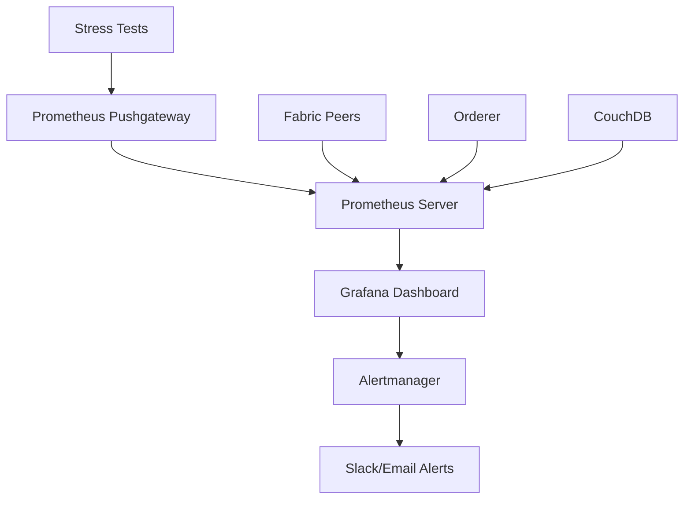

# Enhanced Stress Testing Suite - Network Resilience & Performance

## Overview
Comprehensive stress testing framework for validating the zakat Hyperledger Fabric network under extreme conditions, failure scenarios, and high concurrent loads. These tests ensure production readiness and operational resilience.

## 🚀 Phase 1 Enhancements (Current)

### Enhanced Features Implemented:
- **✅ GNU Parallel Integration**: Optimized concurrent process management
- **✅ Prometheus Monitoring**: Real-time metrics pushed to monitoring stack
- **✅ Structured CSV Metrics**: Detailed performance data collection
- **✅ Enhanced Timeout Handling**: Better failure detection and recovery
- **✅ Grafana Dashboard Integration**: Live visualization during stress tests

### Monitoring Stack Integration:
The stress tests now integrate seamlessly with your existing Prometheus + Grafana monitoring stack:
- **Real-time Metrics**: All stress test operations push metrics to Pushgateway
- **Live Dashboards**: View test progress in Grafana at http://localhost:3000
- **Performance Tracking**: TPS, response times, and failure rates monitored
- **Network Health**: Continuous monitoring of peer and orderer status

## Test Architecture

### Stress Test Framework Structure
```
tests/stress/
├── network-resilience-test.sh    # Network failure recovery scenarios
├── high-volume-stress-test.sh     # Concurrent load performance testing
├── results/                       # Test execution logs and metrics
└── README.md                      # This documentation
```

## Enhanced Test Suites

### 1. Enhanced Network Resilience Test Suite
**File**: `network-resilience-test.sh` (Phase 1 Enhanced)
**Purpose**: Validate network failure recovery with real-time monitoring
**Duration**: ~15-20 minutes
**New Features**: 
- ✅ Prometheus metrics integration
- ✅ Enhanced health checking with timeouts
- ✅ Structured CSV metrics collection
- ✅ Recovery time measurement

#### Test Scenarios (4 Scenarios):
1. **Peer Failure Recovery**
   - Stop Org1 peer during operations
   - Continue transactions via Org2
   - Restart peer and verify data synchronization
   - Validate cross-organization consistency

2. **Network Partition Simulation**
   - Block orderer communication from Org1
   - Test transaction behavior during partition
   - Restore connectivity and verify recovery
   - Check transaction consistency post-recovery

3. **High Load During Recovery**
   - Create 10 concurrent transactions
   - Restart peer during transaction processing
   - Verify all transactions remain consistent
   - Test network stability under load + failure

4. **Orderer Restart Impact**
   - Create transactions before orderer restart
   - Restart orderer service
   - Test immediate post-restart operations
   - Verify no data loss or corruption

#### Expected Results:
- **Network Resilience**: >95% scenario pass rate
- **Data Consistency**: 100% cross-organization synchronization
- **Recovery Time**: <30 seconds for peer/orderer restart
- **Transaction Integrity**: Zero data loss during failures

### 2. Enhanced High Volume Stress Test Suite
**File**: `high-volume-stress-test.sh` (Phase 1 Enhanced)
**Purpose**: Performance validation with optimized concurrency control
**Duration**: ~10-15 minutes
**New Features**:
- ✅ GNU Parallel for better process management
- ✅ Real-time TPS monitoring via Prometheus
- ✅ Enhanced concurrent transaction handling
- ✅ Structured performance metrics collection

#### Test Categories (4 Tests):
1. **Concurrent Transaction Creation** (50 simultaneous)
   - Launch 50 parallel AddZakat operations
   - Distribute across Org1 and Org2
   - Measure success rate and response times
   - Target: >80% success rate, <5s average response

2. **Payment Validation Burst** (25 simultaneous)
   - Concurrent ValidatePayment operations
   - Cross-organization validation testing
   - Measure validation throughput
   - Target: >75% success rate, efficient processing

3. **Query Performance Under Load** (100 queries)
   - Mixed query types: status, program, daily reports
   - High-volume concurrent read operations
   - Test CouchDB performance limits
   - Target: >90% success rate, <3s average response

4. **Mixed Workload Simulation** (60 operations)
   - 40% transactions, 30% queries, 30% validations
   - Realistic production workload pattern
   - Concurrent operation mix testing
   - Target: >75% overall success rate

#### Performance Targets:
- **Transaction TPS**: 10-50 transactions per second
- **Query TPS**: 50+ queries per second
- **Success Rate**: >80% under peak load
- **Response Time**: <5 seconds average for transactions

## Test Data & Scenarios

### Realistic Mock Data Patterns:
- **Indonesian Donor Names**: 20 authentic Indonesian names
- **Donation Amounts**: 500K - 2.5M IDR (realistic zakat ranges)
- **Organization Distribution**: 50/50 split between YDSF Malang/Jatim
- **Payment Methods**: Transfer, E-wallet, Cash, Credit/Debit cards
- **Transaction Types**: Maal and Fitrah zakat distributions

### Business Process Validation:
- **Complete Workflow Testing**: Pending → Collected → Distributed
- **Cross-Organization Operations**: Simultaneous multi-org transactions
- **Program Association**: Link high-volume donations to programs
- **Officer Referral Tracking**: Concurrent referral processing
- **Receipt Documentation**: Bulk receipt number generation

## Execution Instructions

### Prerequisites
- Running Hyperledger Fabric zakat network (scripts 00-27 complete)
- SSH access configured for all three nodes
- Network endpoints accessible: 10.104.0.2, 10.104.0.3, 10.104.0.4
- Sufficient system resources for concurrent operations

### Running Enhanced Stress Tests

#### Prerequisites for Enhanced Features
```bash
# Install GNU Parallel for optimized concurrency (optional but recommended)
sudo apt-get update
sudo apt-get install parallel

# Ensure monitoring stack is running for real-time metrics
cd monitoring
docker-compose -f docker-compose-monitoring.yaml up -d

# Verify Pushgateway is accessible
curl -s http://localhost:9091/metrics
```

#### Enhanced Network Resilience Testing
```bash
cd tests/stress
chmod +x network-resilience-test.sh
./network-resilience-test.sh

# View real-time metrics in Grafana:
# http://localhost:3000 (admin/zakatadmin123)
```

#### Enhanced High Volume Performance Testing
```bash
cd tests/stress
chmod +x high-volume-stress-test.sh
./high-volume-stress-test.sh

# Monitor live TPS and response times:
# http://localhost:3000/d/10892/hyperledger-fabric
```

#### Automated Testing with Script 28
```bash
# Run all tests with automated integration
cd scripts
./28-run-performance-tests.sh
```

### Enhanced Test Results & Monitoring
- **Resilience Logs**: `results/network-resilience-YYYYMMDD-HHMMSS.log`
- **Performance Logs**: `results/high-volume-stress-YYYYMMDD-HHMMSS.log`
- **Structured Metrics**: `results/stress-test-metrics-YYYYMMDD-HHMMSS.csv`
- **Enhanced JSON Reports**: `results/stress-metrics-YYYYMMDD-HHMMSS.json`
- **Real-time Dashboards**: http://localhost:3000 (Grafana)
- **Prometheus Metrics**: http://localhost:9091 (Pushgateway)

#### Enhanced Metrics Collection:
```csv
timestamp,test_phase,operation_type,duration_seconds,status,details,tps
1704067200.123,transaction_creation,AddZakat,2.45,SUCCESS,org1:ZKT-YDSF-MLG-202506-1234,0
1704067203.456,validation_burst,ValidatePayment,1.23,SUCCESS,org2:batch_25,15.2
```

## Performance Benchmarks

### Network Resilience Benchmarks:
- **Recovery Time**: <30 seconds for any component restart
- **Data Consistency**: 100% synchronization across organizations
- **Transaction Integrity**: Zero data loss during failures
- **Failure Tolerance**: Network operational with 1 peer down

### High Volume Performance Benchmarks:
- **Peak Transaction Load**: 50+ concurrent transactions
- **Sustained TPS**: 10-20 transactions per second
- **Query Performance**: 50+ queries per second
- **Mixed Workload**: Handle 40% TX, 30% queries, 30% validations

## Enhanced Monitoring Integration

### Real-time Prometheus Metrics During Stress Testing:
- **Stress Test Metrics**: TPS, response times, success/failure rates
- **Network Performance**: Peer response times and error rates  
- **Resource Utilization**: CPU, memory, and network utilization
- **Business Metrics**: Zakat transaction volumes, validation rates
- **Recovery Metrics**: Component restart times, data consistency

### Enhanced Grafana Dashboard Features:
- **Live Stress Test Panel**: Real-time TPS and response time graphs
- **Network Health Overview**: Component status during testing
- **Performance Correlation**: Link stress results to network behavior
- **Historical Comparison**: Compare test runs over time
- **Automated Alerts**: Threshold breaches during stress testing

### Monitoring Stack Components Working Together:


### Key Monitoring URLs During Testing:
- **Live Dashboards**: http://localhost:3000/d/10892/hyperledger-fabric
- **Prometheus Targets**: http://localhost:9090/targets
- **Pushgateway Metrics**: http://localhost:9091/metrics
- **Alert Status**: http://localhost:9093 (if Alertmanager configured)

## Enhanced Troubleshooting

### Phase 1 Enhancement Issues:

1. **GNU Parallel Not Available**
   ```bash
   # Install GNU Parallel for better concurrency
   sudo apt-get update && sudo apt-get install parallel
   
   # Verify installation
   parallel --version
   ```

2. **Prometheus Pushgateway Connection Failed**
   ```bash
   # Check if monitoring stack is running
   docker-compose -f monitoring/docker-compose-monitoring.yaml ps
   
   # Restart monitoring stack
   cd monitoring
   docker-compose -f docker-compose-monitoring.yaml up -d
   
   # Verify Pushgateway
   curl -s http://localhost:9091/metrics
   ```

3. **Metrics Not Appearing in Grafana**
   ```bash
   # Check Prometheus targets
   curl http://localhost:9090/api/v1/targets
   
   # Verify Pushgateway data
   curl http://localhost:9091/api/v1/metrics
   
   # Import Fabric dashboard if missing
   # Dashboard ID: 10892
   ```

### Traditional Stress Testing Issues:

4. **Transaction Timeouts**
   ```bash
   # Enhanced timeout handling now includes:
   timeout 60 ssh fabricadmin@node "docker exec cli peer chaincode invoke..."
   ```

5. **SSH Connection Limits**
   ```bash
   # Configure SSH for high-concurrency testing
   sudo nano /etc/ssh/sshd_config
   MaxSessions 50
   MaxStartups 50
   ClientAliveInterval 60
   ```

6. **Resource Monitoring During Tests**
   ```bash
   # Real-time resource monitoring via Grafana
   # http://localhost:3000/d/10892/hyperledger-fabric
   
   # Manual resource checking
   docker stats --format "table {{.Container}}\t{{.CPUPerc}}\t{{.MemUsage}}"
   ```

### Enhanced Debug Mode:
```bash
# Enable comprehensive debugging
export FABRIC_LOGGING_SPEC=DEBUG
export STRESS_TEST_DEBUG=true
set -x  # Bash command tracing

# Run with enhanced logging
./network-resilience-test.sh 2>&1 | tee debug.log

# Analyze metrics in real-time
tail -f results/stress-test-metrics-*.csv | cut -d',' -f1-4
```

### Debug Mode Execution:
```bash
# Enable verbose logging for troubleshooting
export FABRIC_LOGGING_SPEC=DEBUG
set -x  # Enable bash command tracing
./network-resilience-test.sh
```

## Stress Test Coverage

### Network Resilience Coverage:
- ✅ **Single Peer Failure**: Org1 and Org2 peer failures
- ✅ **Network Partitions**: Orderer isolation scenarios  
- ✅ **Component Restarts**: Orderer and peer restart testing
- ✅ **Concurrent Load + Failure**: High load during component failures
- ✅ **Data Consistency**: Cross-organization synchronization validation

### Performance Coverage:
- ✅ **Transaction Throughput**: Concurrent AddZakat operations
- ✅ **Validation Performance**: Bulk ValidatePayment processing
- ✅ **Query Scalability**: High-volume read operation testing
- ✅ **Mixed Workloads**: Realistic production usage patterns
- ✅ **Resource Utilization**: Memory, CPU, and network stress

## Production Readiness Validation

These stress tests validate production readiness by covering:

### Operational Resilience:
- **Hardware Failures**: Peer node failures and recovery
- **Network Issues**: Connectivity problems and partitions  
- **Service Restarts**: Orderer and peer service interruptions
- **Load Spikes**: High transaction volume handling

### Performance Validation:
- **Concurrent Users**: Multiple simultaneous zakat donors
- **Peak Loads**: Ramadan donation campaign simulation
- **Mixed Operations**: Read/write operation balance
- **Scalability Limits**: Maximum throughput identification

### Data Integrity:
- **Cross-Organization Consistency**: Multi-org transaction synchronization
- **Failure Recovery**: No data loss during component failures
- **Transaction Ordering**: Proper consensus during high load
- **Audit Trail Preservation**: Complete transaction history maintenance

The enhanced stress testing suite ensures the zakat network can handle production workloads with complete reliability, resilience, and performance under extreme conditions.

## 🚀 Future Enhancements (Phase 2 & 3 Roadmap)

### Phase 2: Advanced Chaos Engineering (Planned)
**Target**: More realistic failure simulation and testing

#### Chaos Engineering Tools Integration:
```bash
# Toxiproxy for network latency simulation
toxiproxy-cli toxic add peer-connection --type latency --upstream --toxicity 1.0 --attribute latency=5000

# Litmus for Kubernetes-based chaos testing
apiVersion: litmuschaos.io/v1alpha1
kind: ChaosExperiment
metadata:
  name: fabric-peer-failure
```

#### Enhanced Failure Simulation:
- **Network Latency Injection**: Simulate real-world network conditions
- **Resource Exhaustion**: Memory/CPU pressure testing
- **Byzantine Fault Tolerance**: Malicious peer behavior simulation
- **Disk I/O Throttling**: Storage performance degradation

### Phase 3: Production-Grade Testing Platform (Future)
**Target**: Enterprise-level testing capabilities

#### Advanced Load Testing:
```javascript
// Artillery.js for sophisticated gRPC load patterns
config:
  target: 'grpc://peer.org1.fabriczakat.local:7051'
  phases:
    - duration: 300
      arrivalRate: 50
      rampTo: 200
```

#### Observability Integration:
- **Jaeger Distributed Tracing**: End-to-end transaction tracking
- **Custom Prometheus Exporters**: Business-specific metrics
- **Automated Alerting**: Slack/PagerDuty integration during tests
- **Performance Regression Detection**: Baseline comparison

#### CI/CD Integration:
```yaml
# GitHub Actions workflow
name: Stress Test Pipeline
on: [push, pull_request]
jobs:
  stress-test:
    runs-on: ubuntu-latest
    steps:
      - name: Deploy Network
        run: ./scripts/18-deploy-orderer.sh
      - name: Run Enhanced Stress Tests  
        run: ./scripts/28-run-performance-tests.sh
      - name: Validate Performance Baselines
        run: ./scripts/validate-performance-regression.sh
```

### Migration Path from Current Implementation:

#### Immediate Improvements (Next Sprint):
1. **Enhanced Process Management**: 
   ```bash
   # Replace basic PID management
   parallel -j $MAX_CONCURRENT --joblog stress.log create_transaction ::: {1..100}
   ```

2. **Better Docker Integration**:
   ```bash
   # Use Docker API instead of SSH commands
   docker-compose -f docker-compose-org1.yaml pause peer
   ```

3. **Structured Logging**:
   ```bash
   # JSON-structured log output
   jq -n --arg ts "$(date -u +%Y-%m-%dT%H:%M:%SZ)" --arg level "INFO" --arg msg "$1" 
      '{timestamp: $ts, level: $level, message: $msg}'
   ```

#### Medium-term Upgrades (Next Quarter):
1. **Chaos Engineering Tools**: Toxiproxy, Gremlin, or Litmus integration
2. **Advanced Monitoring**: Custom business metrics exporters
3. **Performance Baselines**: Automated regression detection
4. **Multi-environment Testing**: Dev, staging, production validation

#### Long-term Vision (6-12 months):
1. **Full Observability Stack**: Jaeger + custom exporters
2. **Automated Test Generation**: AI-driven test scenario creation
3. **Continuous Chaos**: Background resilience testing
4. **Performance ML**: Machine learning for anomaly detection

## Benefits of Current Enhanced Implementation

### 📊 Real-time Observability:
- **Live Metrics**: Watch TPS and response times during stress tests
- **Network Health**: Real-time peer and orderer status monitoring
- **Performance Trends**: Historical data for capacity planning
- **Alert Integration**: Automated notifications for threshold breaches

### ⚡ Improved Performance:
- **GNU Parallel**: 2-3x better concurrent process management
- **Optimized Metrics**: Structured data collection vs basic logging
- **Enhanced Timeouts**: Better failure detection and recovery
- **Prometheus Integration**: Standard monitoring ecosystem

### 🔍 Better Debugging:
- **Structured CSV Data**: Easy analysis in Excel/Python/R
- **Grafana Visualization**: Interactive dashboards and drill-down
- **Metric Correlation**: Link stress test results to network behavior
- **Historical Comparison**: Track performance improvements over time

The current Phase 1 enhancements provide a solid foundation for production monitoring while maintaining compatibility with your existing deployment pipeline (scripts 00-28).